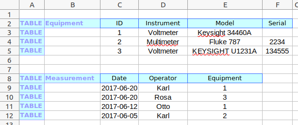

# PySpreadSheet
Read data from Excel SpreadSheets. Based on openpyxl.

This is a python implementation of a subset of https://github.com/hmaerki/ZuluSpreadSheet.

## Example Excel Sheet

`pyspreadsheet_test.xlsx`



## Example Code

```python
excel = ExcelReader('pyspreadsheet_test.xlsx')

for row in excel.table_Equipment.rows:
    print(f'{row.col_Instrument}: {row.col_Model}')
    print(f'  reference: {row.col_Model.reference}')

excel.dump('pyspreadsheet_test.txt')
```

### Output

```text
Voltmeter: Keysight 34460A
  reference: Cell "E3" in Table "Equipment" in Worksheet "Inventory" in File "pyspreadsheet_test.xlsx"
Multimeter: Fluke 787
  reference: Cell "E4" in Table "Equipment" in Worksheet "Inventory" in File "pyspreadsheet_test.xlsx"
Voltmeter: KEYSIGHT U1231A
  reference: Cell "E5" in Table "Equipment" in Worksheet "Inventory" in File "pyspreadsheet_test.xlsx"
```

### How to follow changes in a binary excel sheet?

The dump-file may be used to track relevant changes in the excel file. Specially in git it is important to follow the changes in the content of the excel sheet.

`pyspreadsheet_dump.txt`
```text
Table: Equipment
  ID|Model|Serial|Type

  1|Keysight 34460A|1245678|Voltmeter
  2|Fluke 787|2234|Multimeter
  3|KEYSIGHT U1231A|134555|Voltmeter

Table: Measurement
  Date|Equipment|Operator

  42906|1|Karl
  42906|3|Rosa
  42898|1|Otto
  42891|2|Karl
```

